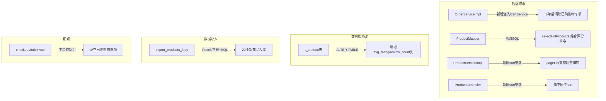

## 需求描述

### 1. 购物车买完不会清空

用户下单成功后，购物车中已购买的商品仍然存在，需要在下单后自动清除已购商品。

### 2. 商品推荐算法

热门推荐目前仅按销量排序，需要结合销量（salesCount）和评分（avgRating）进行综合评分，选出 Top 10 推荐商品。

### 3. 每个商品类型加入四个实例商品

目前每个分类已有 8 个商品，需要为 5 个分类各新增 4 个，共 20 个商品（附带真实图片）。

### 4. 商品列表综合排序 / 价格筛选 / 销量筛选

- "综合"排序：按推荐算法评分排序（销量+评分加权）
- "价格↑/↓"：当前不生效，需要修复
- "销量"：按销量降序排序
- 后端需接收前端传递的 sort 参数并正确排序

## 技术栈

- 后端：Spring Boot 3.2.5 + MyBatis-Plus + MySQL + Redis
- 前端：Vue 3 + Pinia + Element Plus
- 图片源：Pexels API（已有密钥）

## 实现方案

### 架构概览



### 推荐算法设计

```
综合评分 = salesCount × 0.6 + avgRating × 20 × 0.4
```

- salesCount 权重 0.6（销量更重要）
- avgRating 最大 5 分，乘以 20 归一化到 100 分尺度，权重 0.4
- 最终按综合评分降序取 Top 10

### 商品列表排序设计

| sort参数 | 排序方式 |
| --- | --- |
| default/无 | 综合评分降序（销量+评分） |
| price_asc | price ASC |
| price_desc | price DESC |
| sales | sales_count DESC |


### 购物车清空逻辑

`OrderServiceImpl.createOrder()` 中，在订单创建成功后，注入 `CartService`，对每个购买的商品调用 `cartService.removeFromCart(userId, productId)`，清除已购项（仅清除选中购买的部分）。

### 数据一致性

新增 `avg_rating` 和 `review_count` 数据库列，确保 `Product.updateProductRating()` 方法写入评分时不会报 SQL 错误。

## 实现要点

### 性能注意事项

- `selectHotProducts` 改为使用新算法，避免不必要的表连接
- 商品列表排序使用 MyBatis-Plus LambdaQueryWrapper 动态拼接 ORDER BY，无需额外 SQL

### 避免技术债务

- 所有修改复用现有模式（MyBatis-Plus、Spring DI、Vue 3 Composition API）
- `Product.java` 中的 `avgRating/reviewCount` 字段保持不变，仅补全数据库列
- 不重构现有 API 接口，仅扩展参数

### 出错处理

- 购物车清除失败不应影响订单创建（使用 try-catch 包裹）
- 排序参数不合法时降级为默认排序

## 目录结构

```
d:\电商平台项目\
├── import_products_3.py          # [NEW] 追加20个商品的导入脚本
├── server/src/main/java/com/char1234/
│   ├── controller/
│   │   └── ProductController.java      # [MODIFY] 新增 sort 参数接收
│   ├── service/
│   │   ├── ProductService.java          # [MODIFY] pageList 方法签名新增 sort
│   │   └── impl/
│   │       ├── ProductServiceImpl.java  # [MODIFY] 实现动态排序逻辑 + 新热门推荐算法
│   │       └── OrderServiceImpl.java    # [MODIFY] 下单后清空购物车（注入CartService）
│   └── mapper/
│       └── ProductMapper.java           # [MODIFY] selectHotProducts SQL 改为综合评分
├── client-front/src/
│   ├── views/
│   │   └── checkout/index.vue           # [MODIFY] 下单成功后删除已购购物车项
│   └── stores/
│       └── cart.js                      # [MODIFY] 新增 removeItems 方法批量删除
└── db_migration.sql                     # [MODIFY] 新增 ALTER TABLE 加 avg_rating/review_count 列
```

## 关键代码结构

### ProductService.pageList 新签名

```java
// 新增 sort 参数
Page<Product> pageList(Integer page, Integer size, String name, Long categoryId,
                       BigDecimal minPrice, BigDecimal maxPrice, String sort);
```

### 推荐算法 SQL（ProductMapper）

```sql
SELECT p.*, c.name as categoryName,
       (IFNULL(p.sales_count, 0) * 0.6 + IFNULL(p.avg_rating, 0) * 20 * 0.4) as score
FROM t_product p
LEFT JOIN t_category c ON p.category_id = c.id
ORDER BY score DESC
LIMIT #{limit}
```

## 工具扩展

### SubAgent

- **code-explorer**
- 用途：在前置调研阶段搜索关键代码文件位置、文件内容、数据流
- 预期产出：确认所有需要修改的代码文件路径及关联关系