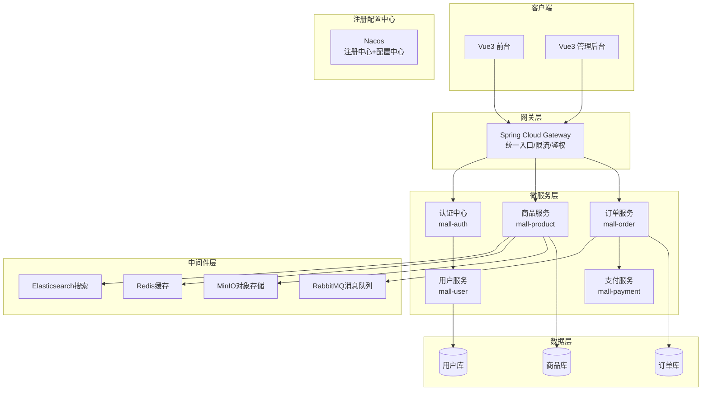
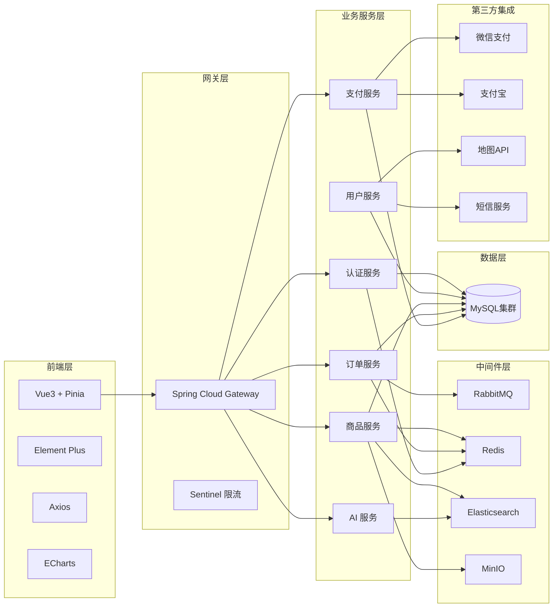

基于现有 Spring Boot + Vue3 电商平台项目，进行全面升级改造。项目名为"悦选商城"。需要：

1. **前台电商网页界面（新开发）**：基于现有后端 API 和数据库，开发一套面向消费者的 Vue3 网页版前台界面，替代原有微信小程序前端。包含首页、商品列表、商品详情、购物车、结算、订单列表、个人中心、登录注册等8个核心页面。

2. **后台管理界面（优化）**：保留并优化现有的 Vue3 管理后台界面（位于 client/），包括仪表盘、商品管理、分类管理、订单管理、用户管理。

3. **Spring Cloud 微服务改造清单**：制定从单体 Spring Boot 迁移到 Spring Cloud 微服务架构的详细方案。

4. **全栈技术选材落地计划**：覆盖5大技术类别（基础核心、进阶中间件、可视化与即时通信、AI集成、第三方拓展），制定分阶段可执行的实施路线图。

## 核心功能

- **前台商城**：用户浏览商品、分类搜索、加入购物车、下单结算、订单管理、个人中心
- **后台管理**：数据仪表盘（ECharts）、商品/分类/订单/用户管理 CRUD
- **接口规范**：RESTful API、JWT 双端认证、Swagger 文档
- **技术架构**：前后端分离、逐渐演进为微服务架构

## 技术栈选型

### 基础核心（当前）

| 层级 | 技术 | 版本 |
| --- | --- | --- |
| 后端框架 | Spring Boot | 3.2.5 |
| JDK | OpenJDK | 17 |
| ORM | MyBatis-Plus | 3.5.5 |
| 数据库 | MySQL | 8.0 |
| JWT | jjwt | 0.9.1 |
| 接口文档 | Knife4j (Swagger) | 4.5+ |
| 前台前端 | Vue 3 + Vite 8 | 3.5.32 |
| 状态管理 | Pinia | 最新 |
| HTTP | Axios | 1.6.8 |
| UI库 | Element Plus | 2.6.3 |
| 图标 | @element-plus/icons-vue | 2.3.1 |
| 可视化 | ECharts | 5.5.0 |


### 进阶中间件（后续追加）

| 技术 | 用途 |
| --- | --- |
| Redis | 商品缓存、购物车、分布式锁、会话管理 |
| RabbitMQ | 订单异步处理、库存扣减、消息通知 |
| Elasticsearch | 商品全文检索（ik分词） |
| MinIO | 商品图片/用户头像对象存储 |


### 微服务体系（后续迁移）

| 组件 | 用途 |
| --- | --- |
| Spring Cloud Gateway | API 网关/路由/限流 |
| Nacos | 注册中心 + 配置中心 |
| Sentinel | 服务熔断/降级/限流 |
| Seata | 分布式事务（TCC/AT模式） |
| Feign + LoadBalancer | 服务间远程调用 |
| Sleuth + Zipkin | 全链路追踪 |


### 可视化与即时通信

| 技术 | 用途 |
| --- | --- |
| ECharts | 管理后台数据大屏 |
| WebSocket | 订单状态实时推送 |


### AI 集成

| 技术 | 用途 |
| --- | --- |
| Spring AI / OpenAI API | AI 购物助手 |
| SSE / WebFlux | 流式输出 |
| LangChain4j / Pgvector | RAG 知识库 |


### 第三方扩展

| 技术 | 用途 |
| --- | --- |
| 支付宝/微信支付沙箱 | 支付对接 |
| 高德/腾讯地图JS API | 物流轨迹 |
| 阿里云/腾讯云 SMS | 手机验证码 |


## 实施架构

### 第一阶段：前台电商界面架构

```
[浏览器 - 悦选商城前台(Vue3)]
    |
    | Axios (JWT Token)
    |
[现有Spring Boot API (localhost:8080)]
    |
    | JWT双端鉴权拦截器
    |
[Controller层] --> [Service层] --> [MyBatis-Plus Mapper]
    |
[MySQL (db_mall)]
```

前台项目 `client-front/` 与后台项目 `client/` 独立部署，共享同一套后端API。前台新增：购物车 API（Redis 存储）、用户手机注册/登录 API。

### 第二阶段：Spring Cloud 微服务架构



### 第三阶段：完整技术栈分层架构



## 实施路线图

```
Phase 1 (1-2周)     Phase 2 (2-3周)      Phase 3 (3-4周)      Phase 4 (4-6周)      Phase 5 (2-3周)
├── Vue3前台开发     ├── 微服务拆分         ├── 中间件集成         ├── AI集成             ├── 第三方集成
│   ├── 项目初始化   │   ├── Nacos部署     │   ├── Redis购物车    │   ├── AI购物助手      │   ├── 支付沙箱
│   ├── 8个核心页面  │   ├── 服务模块拆分  │   ├── RabbitMQ异步   │   ├── 流式输出        │   ├── 物流地图
│   ├── API对接      │   ├── Gateway网关   │   ├── ES商品搜索     │   ├── RAG知识库       │   ├── 短信验证码
│   └── 管理后台优化  │   ├── Feign调用    │   └── MinIO文件存储  │   └── 多模型集成      │   └── 联调测试
│                    │   └── Seata事务     │                     │                      │
└────────────────────└────────────────────└────────────────────└────────────────────└────────────────────
```

## 目录结构

### 第一阶段：新增/修改文件清单

```
d:/电商平台项目/
├── client-front/                        # [NEW] Vue3 前台电商项目
│   ├── index.html                       # 入口 HTML
│   ├── package.json                     # 依赖：vue3, pinia, axios, element-plus, echarts, vue-router
│   ├── vite.config.js                   # Vite 配置（代理/api -> localhost:8080）
│   └── src/
│       ├── main.js                      # [NEW] 入口：挂载 App + Router + Pinia + ElementPlus
│       ├── App.vue                      # [NEW] 根组件（含 TabBar 底部导航布局）
│       ├── router/
│       │   └── index.js                 # [NEW] 路由配置（8个页面 + 导航守卫 + JWT校验）
│       ├── stores/
│       │   ├── user.js                  # [NEW] Pinia 用户状态（token/个人信息/登录登出）
│       │   ├── cart.js                  # [NEW] Pinia 购物车状态（商品列表/数量/选中/结算）
│       │   └── product.js               # [NEW] Pinia 商品状态（分类/搜索/热门）
│       ├── api/
│       │   ├── request.js               # [NEW] Axios 封装（请求拦截器自动附加 Token、响应拦截器错误处理）
│       │   ├── product.js               # [NEW] 商品接口：列表/详情/搜索/热门
│       │   ├── order.js                 # [NEW] 订单接口：创建/列表/详情/取消/支付
│       │   ├── user.js                  # [NEW] 用户接口：登录/注册/个人信息/地址管理
│       │   ├── cart.js                  # [NEW] 购物车接口：增删改查
│       │   └── category.js              # [NEW] 分类接口：列表/树形
│       ├── views/
│       │   ├── home/
│       │   │   └── index.vue            # [NEW] 首页：Banner轮播 + 分类导航 + 热门推荐 + 搜索入口
│       │   ├── product-list/
│       │   │   └── index.vue            # [NEW] 商品列表页：分类筛选 + 关键词搜索 + 价格排序 + 分页
│       │   ├── product-detail/
│       │   │   └── index.vue            # [NEW] 商品详情页：主图展示 + 价格/库存 + 收藏 + 加入购物车
│       │   ├── cart/
│       │   │   └── index.vue            # [NEW] 购物车页：商品列表 + 数量增减 + 全选/删除 + 结算入口
│       │   ├── checkout/
│       │   │   └── index.vue            # [NEW] 结算页：地址选择 + 订单确认 + 提交订单
│       │   ├── orders/
│       │   │   └── index.vue            # [NEW] 订单列表页：按状态筛选 + 订单卡片 + 取消/确认收货
│       │   ├── user/
│       │   │   └── index.vue            # [NEW] 个人中心：用户信息 + 订单入口 + 地址管理 + 收藏管理
│       │   └── login/
│       │       └── index.vue            # [NEW] 登录/注册页：手机号登录 + 短信验证码 + 微信扫码
│       ├── components/
│       │   ├── NavBar.vue               # [NEW] 顶部导航栏：Logo + 搜索框 + 用户入口 + 购物车图标
│       │   ├── TabBar.vue               # [NEW] 底部Tab栏：首页/分类/购物车/我的（4个Tab）
│       │   ├── ProductCard.vue          # [NEW] 商品卡片组件：图片 + 名称 + 价格 + 销量
│       │   ├── CartItem.vue             # [NEW] 购物车项组件：选择框 + 商品信息 + 数量选择器
│       │   ├── AddressPicker.vue        # [NEW] 地址选择组件：三级联动（省/市/区）
│       │   └── OrderCard.vue            # [NEW] 订单卡片组件：订单信息 + 状态标签 + 操作按钮
│       ├── styles/
│       │   └── main.scss                # [NEW] 全局样式：CSS变量 + 设计系统变量 + 响应式断点
│       └── utils/
│           ├── auth.js                  # [NEW] 认证工具：Token存取/过期检查/路由守卫辅助
│           └── format.js                # [NEW] 格式化工具：金额/时间/手机号脱敏
│
├── client/                              # [MODIFY] 现有管理后台优化
│   └── src/
│       ├── router/index.js              # [MODIFY] 新增订单详情路由
│       ├── views/dashboard/index.vue    # [MODIFY] 仪表盘 UI 优化 + 设计系统配色
│       ├── views/product/index.vue      # [MODIFY] 商品管理增加图片上传（预留 MinIO）
│       └── views/order/index.vue        # [MODIFY] 订单管理增加详情弹窗/物流信息
│
├── server/src/main/java/com/char1234/
│   ├── controller/
│   │   ├── CartController.java          # [NEW] 购物车 REST API（基于 Redis Hash 存储）
│   │   └── FrontUserController.java     # [NEW] 前台用户接口（手机号注册/登录/短信验证码）
│   ├── service/
│   │   ├── CartService.java             # [NEW] 购物车服务接口
│   │   └── impl/CartServiceImpl.java    # [NEW] 购物车服务实现（Redis操作）
│   ├── entity/
│   │   └── CartItem.java                # [NEW] 购物车项实体（productId, quantity, selected）
│   └── config/
│       └── Knife4jConfig.java           # [NEW] Knife4j/Swagger 接口文档配置（分组：前台/后台）
│
├── server/pom.xml                       # [MODIFY] 新增依赖：spring-boot-starter-data-redis, knife4j, spring-boot-starter-websocket

├── design-system/
│   └── 悦选商城/
│       ├── MASTER.md                    # [EXIST] 设计系统主文件
│       └── pages/                       # [NEW] 页面级设计覆盖
│           ├── home.md                  # [NEW] 首页设计规格
│           ├── product-detail.md        # [NEW] 商品详情设计规格
│           └── cart.md                  # [NEW] 购物车设计规格
```

### 第二阶段：微服务项目结构（新增）

```
d:/电商平台项目/mall-cloud/
├── pom.xml                              # 父POM（Spring Cloud 2023.x）
├── mall-common/                         # 公共模块
│   └── src/main/java/com/mall/common/
│       ├── result/Result.java           # 统一返回封装
│       ├── exception/GlobalException.java
│       └── util/JwtUtil.java
├── mall-gateway/                        # API网关（Spring Cloud Gateway）
│   └── src/main/java/com/mall/gateway/
│       ├── GatewayApplication.java
│       ├── config/CorsConfig.java
│       └── filter/AuthGlobalFilter.java
├── mall-auth/                           # 认证中心
│   └── src/main/java/com/mall/auth/
│       ├── AuthApplication.java
│       ├── controller/AuthController.java
│       └── service/AuthService.java
├── mall-user/                           # 用户服务
├── mall-product/                        # 商品服务
├── mall-order/                          # 订单服务
└── mall-payment/                        # 支付服务
```

## 实现要点

### API 设计规范

- 统一响应格式：`{ code: 200, message: "success", data: {...} }`
- 前台API前缀：`/api-front/**`（使用 JWT principal = MP_USER）
- 后台API前缀：`/api/admin/**`（使用 JWT principal = ADMIN）
- Swagger 分组：前台接口组 + 后台接口组

### 购物车设计

- 使用 Redis Hash 存储，key = `cart:userId`，field = `productId`，value = `{quantity, selected}`
- 未登录用户使用本地存储（localStorage），登录后同步到服务端
- 库存校验在结算时实时进行

### 前台 UI 设计

- 色调：紫色主色 (#7C3AED) + 绿色CTA (#22C55E)，白色背景 (#FAF5FF)
- 字体：Rubik（标题）+ Nunito Sans（正文）
- 交互：商品卡片 hover 上浮效果 (translateY(-2px))，按钮 200ms 过渡
- 响应式：375px / 768px / 1024px / 1440px 四档断点

### 微服务迁移策略

- 先拆分无状态服务（认证/用户），后拆分有状态服务（订单/支付）
- 使用Seata AT模式处理分布式事务（下单扣库存 + 支付回调）
- 数据库先逻辑拆分（分库），再考虑分表
- 网关层统一处理跨域 + 鉴权 + 限流

## 设计综述

悦选商城整体采用 **Vibrant & Block-based**（鲜艳块状设计）风格，融合现代电商的动感与品牌信任感。

### 前台电商界面设计

**首页**：

- 顶部固定导航栏（Logo+搜索框+购物车图标+登录入口）
- Hero区域：全宽Banner轮播（自动播放 + 指示器圆点）
- 分类导航区：8个分类图标网格（带SVG图标 + 名称）
- 热门推荐区：4列商品卡片网格（卡片 hover 上浮+阴影加深）
- 底部TabBar：首页/分类/购物车/我的（当前页高亮紫色）

**商品列表页**：

- 顶部：分类Tab切换（横向滚动）
- 筛选栏：排序（综合/价格/销量）+ 价格区间输入
- 商品网格：2列（移动端）/ 3列（平板）/ 4列（桌面）
- 分页：滚动加载更多（InfiniteScroll）或传统分页

**商品详情页**：

- 商品主图：大图展示 + 缩略图列表
- 商品信息：名称 + 价格（绿色CTA色突出）+ 销量 + 库存
- 操作区：数量选择器 + 收藏按钮（心形图标）+ 加入购物车按钮（紫色）
- 商品描述：富文本渲染

**购物车页**：

- 列表模式：每项商品带选择框/缩略图/名称/单价/数量选择器/小计/删除
- 底部操作栏：全选 + 总计金额 + 结算按钮（绿色CTA）

**结算页**：

- 收货地址：卡片展示 + 选择/新增地址弹窗
- 商品清单：只读列表（缩略图 + 名称 + 单价 + 数量）
- 订单汇总：商品总额 + 运费 + 实付金额
- 提交按钮：全宽绿色CTA按钮

**个人中心**：

- 用户头像 + 昵称（顶部区域带磨砂玻璃效果背景）
- 功能入口网格：我的订单 / 收货地址 / 我的收藏 / 设置
- 订单快捷入口：待支付 / 已支付 / 已发货 / 已完成 四个Tab

**登录页**：

- 居中卡片式登录框
- 手机号输入 + 短信验证码（带60秒倒计时）
- 微信扫码登录入口（二维码样式）
- 用户协议 + 隐私政策勾选

### 管理后台界面优化

保留现有 Element Plus 布局，仅优化：

- 仪表盘配色对齐设计系统（紫色主色）
- 侧边栏图标优化（使用 element-plus/icons-vue）
- 表格 hover 行高亮颜色适配
- 统一样式变量文件

### 色彩策略

- 紫色 #7C3AED 为核心品牌色，用于导航栏/按钮/高亮
- 绿色 #22C55E 为交易色，用于购买/结算/成功状态
- 浅紫背景 #FAF5FF 营造柔和购物氛围
- 深色文字 #4C1D95 保证可读性

### 交互效果

- 卡片 hover 上浮 + 阴影加深 + 200ms 过渡
- 按钮点击波纹效果
- 加入购物车飞入动画
- 页面切换淡入淡出
- 骨架屏加载占位

## Agent Extensions

### Skills

- **ui-ux-pro-max**: UI/UX 设计智能数据库，用于在开发每个页面时查询最佳设计实践、色彩搭配、排版方案。设计系统已持久化到 `design-system/悦选商城/MASTER.md`，每个页面开发前使用 `--design-system --persist -p "悦选商城" --page "page-name"` 命令获取该页面的设计覆盖规格。
- **tdd**: 测试驱动开发技能，用于开发后端新增的购物车API、用户注册API时，采用红绿重构循环编写单元测试，确保接口正确性。
- **review**: 代码审查技能，在每个阶段完成后，运行 review 技能检查代码质量、是否符合设计规范和编码标准。

### SubAgent

- **code-explorer**: 代码探索子代理，用于在需要理解现有代码的调用链路、数据流、配置细节时进行多文件深度探索，确保新代码与现有架构保持一致。