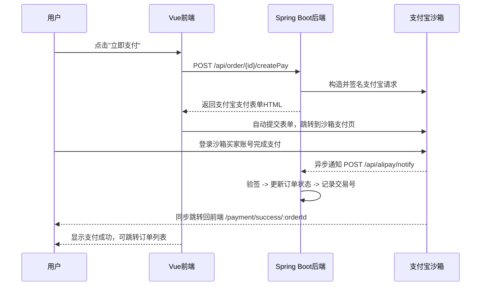

## 产品概述

为悦选商城电商平台集成支付宝沙箱支付功能，替换现有的纯模拟支付（直接改订单状态），实现真实的支付宝支付流程。

## 核心功能

1. **支付宝支付下单**: 用户在订单列表点击"立即支付"，后端调用支付宝沙箱 API 生成支付表单，前端自动提交跳转到支付宝沙箱支付页面
2. **同步跳回转跳**: 用户在支付宝完成支付后，自动跳转回商城前端，显示支付成功状态
3. **异步通知处理**: 支付宝服务器异步通知后端支付结果，后端校验签名后更新订单状态
4. **支付成功后续处理**: 订单状态更新为已支付、更新销量、记录支付宝交易号与支付时间
5. **数据库扩展**: `t_order` 表新增 `pay_no`（支付宝交易号）和 `pay_time`（支付时间）字段

## 确认的配置信息

| 配置项 | 值 |
| --- | --- |
| APPID | 9021000164680166 |
| 应用私钥 | MIIEvQIBADAN... (PKCS8格式RSA2私钥) |
| 支付宝公钥 | MIIBIjANBgkqh... (RSA2公钥) |
| 外网回调地址 | `http://wdba29a3.natappfree.cc` (映射到本地8080) |
| 异步通知URL | `http://wdba29a3.natappfree.cc/api/alipay/notify` |
| 前端跳回地址 | 支付成功后跳转到订单列表 `/orders` |


## 技术栈

- **后端**: Spring Boot 3.2.5 + Java 17 + MyBatis-Plus + Maven
- **前端**: Vue 3 + Pinia + Tailwind CSS + Element Plus + Axios
- **支付宝SDK**: `com.alipay.sdk:alipay-sdk-java:4.39.41.ALL`
- **外网穿透**: natapp (免费版域名可变，需注意)

## 实现方案

### 支付流程架构



### 关键设计决策

| 决策 | 方案 | 理由 |
| --- | --- | --- |
| 支付表单生成 | 后端生成完整HTML表单字符串，前端动态创建form并submit | 避免前端接触签名逻辑，密钥仅在后端 |
| 同步回调接口 | 后端 `return` 接口接收后重定向到前端支付成功页 | natapp仅映射8080，前端5173无法被外部访问 |
| 异步通知 | 传统 POST notify URL，无需认证，仅验签 | 支付宝标准流程 |
| 密钥安全 | 配置写入 application.yml，`.gitignore` 保护 | 防止私钥泄露 |
| 幂等处理 | 异步通知中如订单已支付则直接返回 `success` | 防止支付宝重复通知导致重复处理 |


### 数据库变更

```sql
ALTER TABLE `t_order`
  ADD COLUMN `pay_no` varchar(64) DEFAULT NULL COMMENT '支付宝交易号' AFTER `status`,
  ADD COLUMN `pay_time` datetime DEFAULT NULL COMMENT '支付时间' AFTER `pay_no`;
```

### 目录结构

#### 后端修改/新建

```
server/
├── pom.xml                                                    # [MODIFY] 添加 alipay-sdk-java 依赖
├── src/main/resources/application.yml                         # [MODIFY] 添加 alipay 配置段
└── src/main/java/com/char1234/
    ├── config/
    │   └── AlipayProperties.java                              # [NEW] @ConfigurationProperties 读取支付宝配置
    ├── entity/
    │   └── Order.java                                         # [MODIFY] 添加 payNo、payTime 字段
    ├── service/
    │   ├── OrderService.java                                  # [MODIFY] 添加 payOrderWithAlipay() 接口方法
    │   ├── impl/
    │   │   └── OrderServiceImpl.java                          # [MODIFY] 实现 payOrderWithAlipay，写入pay_no/pay_time
    │   └── AlipayService.java                                 # [NEW] 支付宝核心服务：创建支付、验签、通知处理
    └── controller/
        ├── OrderController.java                               # [MODIFY] 添加 createPay 接口 + alipayReturn 重定向接口
        └── AlipayNotifyController.java                        # [NEW] 支付宝异步通知接收端点
```

#### 数据库变更

```
db_migration_alipay.sql                                        # [NEW] ALTER TABLE 添加字段
```

#### 前端修改/新建

```
client-front/src/
├── api/
│   └── order.js                                               # [MODIFY] 添加 createAlipayPay(id) API
├── views/
│   └── payment/
│       ├── index.vue                                          # [NEW] 支付中页面：自动提交表单到支付宝
│       └── success.vue                                        # [NEW] 支付成功页：显示成功信息及跳转
├── components/
│   └── OrderCard.vue                                          # [MODIFY] "立即支付"按钮跳转到支付页
└── router/
    └── index.js                                               # [MODIFY] 添加支付相关路由
```

### 实现笔记

1. **natapp 域名限制**: 免费版 natapp 域名每次启动可能变化，如域名失效请在 `application.yml` 中更新 `alipay.return-url` 和 `alipay.notify-url`
2. **订单状态不变**: 所有涉及订单状态判断的代码（-1取消/0待支付/1已支付/2已发货/3已完成）均保持不变
3. **幂等设计**: 异步通知处理中先检查订单状态，如已支付则直接返回 `success`，避免重复处理
4. **调试建议**: 先启动后端，用 Postman 测试 `POST /api/order/{id}/createPay` 是否返回表单HTML，再用浏览器打开natapp域名验证外网可达
5. **沙箱测试账号**: 登录 [支付宝沙箱控制台](https://open.alipay.com/develop/sandbox/app) 查看"沙箱买家"账号信息，用此账号在沙箱支付页面登录

## 设计思路

### 支付中转页 (payment/index.vue)

简洁的支付中转页面，不依赖额外 UI 框架的复杂组件。页面仅展示：

- 居中加载动画（旋转图标 + "正在跳转至支付宝"文本）
- 隐藏的支付宝表单自动提交
- 防止用户重复刷新导致重复提交

### 支付成功页 (payment/success.vue)

成功页设计采用轻量级展示：

- 绿色勾号成功图标
- "支付成功"主标题
- 显示订单号和支付金额
- 两个按钮："查看订单" 和 "返回首页"
- 5秒后自动跳转到订单列表

## Agent Extensions

### SubAgent

- **code-explorer**: 已用于探索项目结构、支付相关代码、路由配置、API 层等，确认了完整的修改范围和现有代码模式