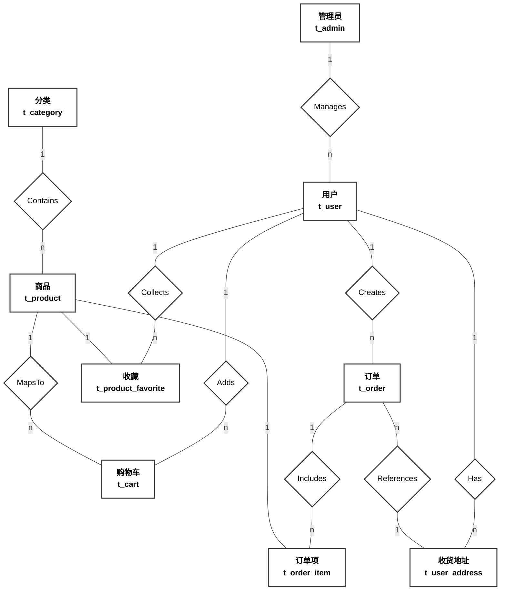
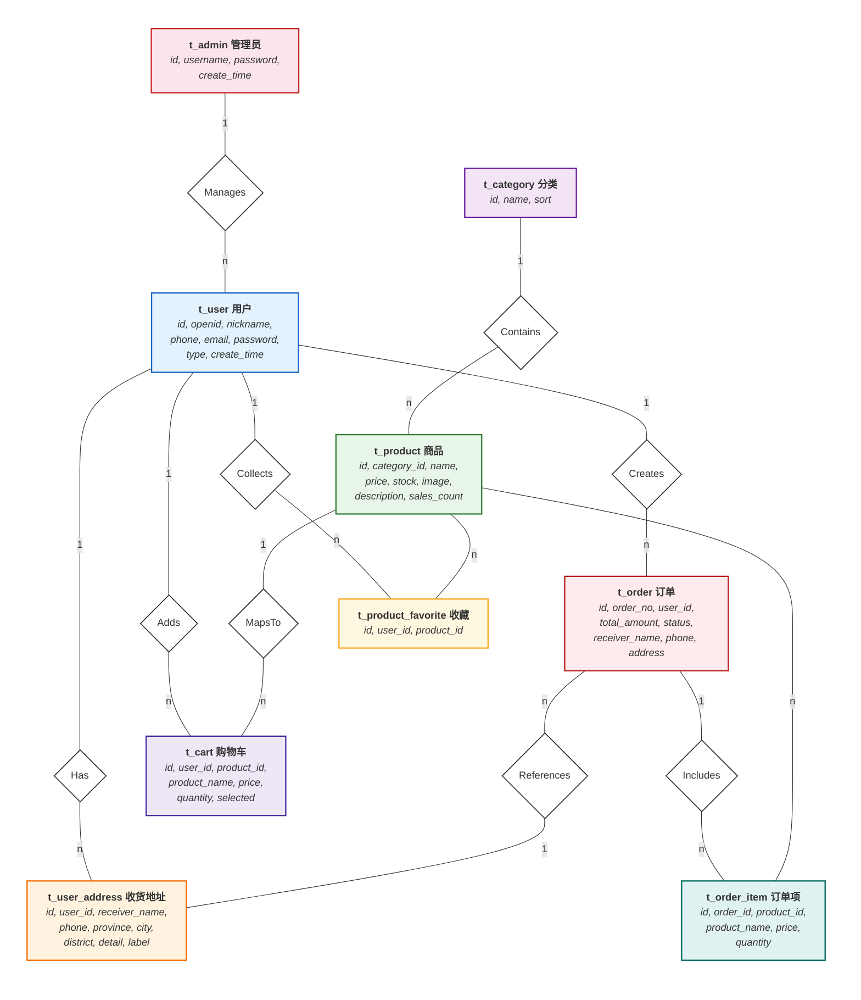

# 悦选商城系统 - Chen风格实体联系图(ER图)

## 复制以下代码到 https://mermaid.live 渲染

```mermaid
flowchart TB
    %% ==================== 实体（矩形） ====================
    User["<b>用户<br/>t_user</b>"]
    Admin["<b>管理员<br/>t_admin</b>"]
    Category["<b>分类<br/>t_category</b>"]
    Product["<b>商品<br/>t_product</b>"]
    Address["<b>收货地址<br/>t_user_address</b>"]
    Cart["<b>购物车<br/>t_cart</b>"]
    Order["<b>订单<br/>t_order</b>"]
    OrderItem["<b>订单项<br/>t_order_item</b>"]
    Favorite["<b>收藏<br/>t_product_favorite</b>"]

    %% ==================== 关系（菱形） ====================
    R1{"Manages"}
    R2{"Contains"}
    R3{"Has"}
    R4{"Adds"}
    R5{"Creates"}
    R6{"MapsTo"}
    R7{"Includes"}
    R8{"References"}
    R9{"Collects"}

    %% ==================== 连线 + 基数 ====================
    Admin ---|"1"| R1 ---|"n"| User
    Category ---|"1"| R2 ---|"n"| Product
    User ---|"1"| R3 ---|"n"| Address
    User ---|"1"| R4 ---|"n"| Cart
    User ---|"1"| R5 ---|"n"| Order
    Product ---|"1"| R6 ---|"n"| Cart
    Order ---|"1"| R7 ---|"n"| OrderItem
    Product ---|"1"| OrderItem
    Order ---|"n"| R8 ---|"1"| Address
    User ---|"1"| R9 ---|"n"| Favorite
    Product ---|"1"| Favorite

    %% ==================== 样式 ====================
    style User fill:#fff,stroke:#333,stroke-width:2px,color:#000
    style Admin fill:#fff,stroke:#333,stroke-width:2px,color:#000
    style Category fill:#fff,stroke:#333,stroke-width:2px,color:#000
    style Product fill:#fff,stroke:#333,stroke-width:2px,color:#000
    style Address fill:#fff,stroke:#333,stroke-width:2px,color:#000
    style Cart fill:#fff,stroke:#333,stroke-width:2px,color:#000
    style Order fill:#fff,stroke:#333,stroke-width:2px,color:#000
    style OrderItem fill:#fff,stroke:#333,stroke-width:2px,color:#000
    style Favorite fill:#fff,stroke:#333,stroke-width:2px,color:#000

    style R1 fill:#fff,stroke:#333,stroke-width:2px,color:#000
    style R2 fill:#fff,stroke:#333,stroke-width:2px,color:#000
    style R3 fill:#fff,stroke:#333,stroke-width:2px,color:#000
    style R4 fill:#fff,stroke:#333,stroke-width:2px,color:#000
    style R5 fill:#fff,stroke:#333,stroke-width:2px,color:#000
    style R6 fill:#fff,stroke:#333,stroke-width:2px,color:#000
    style R7 fill:#fff,stroke:#333,stroke-width:2px,color:#000
    style R8 fill:#fff,stroke:#333,stroke-width:2px,color:#000
    style R9 fill:#fff,stroke:#333,stroke-width:2px,color:#000
```

---

# 备选：带属性标注的完整版（更详细）

```mermaid
flowchart TB
    subgraph ENTITIES[" "]
        direction TB
        User["<b>t_user 用户</b><br/><i>id, openid, nickname,<br/>phone, email, password,<br/>type, create_time</i>"]
        Admin["<b>t_admin 管理员</b><br/><i>id, username, password,<br/>create_time</i>"]
        Category["<b>t_category 分类</b><br/><i>id, name, sort</i>"]
        Product["<b>t_product 商品</b><br/><i>id, category_id, name,<br/>price, stock, image,<br/>description, sales_count</i>"]
        Address["<b>t_user_address 收货地址</b><br/><i>id, user_id, receiver_name,<br/>phone, province, city,<br/>district, detail, label</i>"]
        Cart["<b>t_cart 购物车</b><br/><i>id, user_id, product_id,<br/>product_name, price,<br/>quantity, selected</i>"]
        Order["<b>t_order 订单</b><br/><i>id, order_no, user_id,<br/>total_amount, status,<br/>receiver_name, phone, address</i>"]
        OI["<b>t_order_item 订单项</b><br/><i>id, order_id, product_id,<br/>product_name, price,<br/>quantity</i>"]
        Fav["<b>t_product_favorite 收藏</b><br/><i>id, user_id, product_id</i>"]

        R_mgt{"Manages"}
        R_cat{"Contains"}
        R_addr{"Has"}
        R_cart{"Adds"}
        R_order{"Creates"}
        R_pcart{"MapsTo"}
        R_oi{"Includes"}
        R_ref{"References"}
        R_fav{"Collects"}
    end

    Admin ---|"1"| R_mgt ---|"n"| User
    Category ---|"1"| R_cat ---|"n"| Product
    User ---|"1"| R_addr ---|"n"| Address
    User ---|"1"| R_cart ---|"n"| Cart
    User ---|"1"| R_order ---|"n"| Order
    Product ---|"1"| R_pcart ---|"n"| Cart
    Order ---|"1"| R_oi ---|"n"| OI
    Product ---|"n"| OI
    Order ---|"n"| R_ref ---|"1"| Address
    User ---|"1"| R_fav ---|"n"| Fav
    Product ---|"n"| Fav

    style ENTITIES fill:none,stroke:none
    style User fill:#e3f2fd,stroke:#1565c0,stroke-width:2px
    style Admin fill:#fce4ec,stroke:#c62828,stroke-width:2px
    style Category fill:#f3e5f5,stroke:#6a1b9a,stroke-width:2px
    style Product fill:#e8f5e9,stroke:#2e7d32,stroke-width:2px
    style Address fill:#fff3e0,stroke:#ef6c00,stroke-width:2px
    style Cart fill:#ede7f6,stroke:#4527a0,stroke-width:2px
    style Order fill:#ffebee,stroke:#b71c1c,stroke-width:2px
    style OI fill:#e0f2f1,stroke:#00695c,stroke-width:2px
    style Fav fill:#fff8e1,stroke:#f9a825,stroke-width:2px

    style R_mgt fill:#fff,stroke:#333,stroke-width:1.5px
    style R_cat fill:#fff,stroke:#333,stroke-width:1.5px
    style R_addr fill:#fff,stroke:#333,stroke-width:1.5px
    style R_cart fill:#fff,stroke:#333,stroke-width:1.5px
    style R_order fill:#fff,stroke:#333,stroke-width:1.5px
    style R_pcart fill:#fff,stroke:#333,stroke-width:1.5px
    style R_oi fill:#fff,stroke:#333,stroke-width:1.5px
    style R_ref fill:#fff,stroke:#333,stroke-width:1.5px
    style R_fav fill:#fff,stroke:#333,stroke-width:1.5px
```
